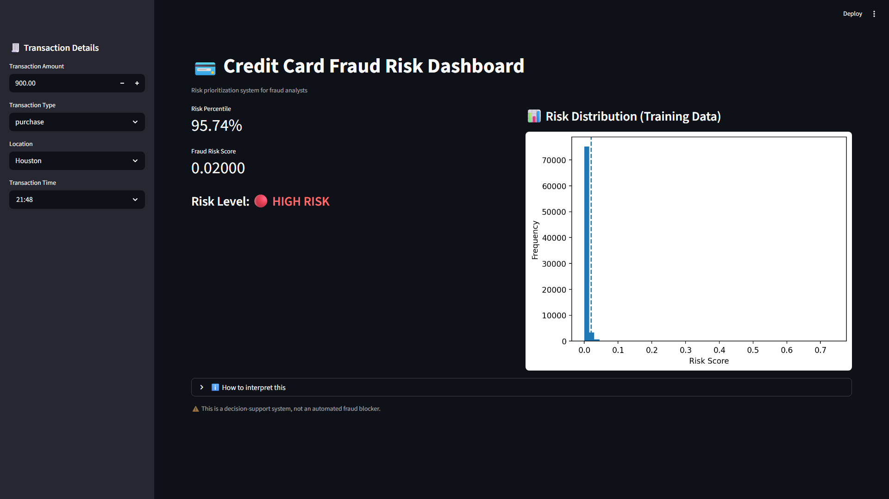
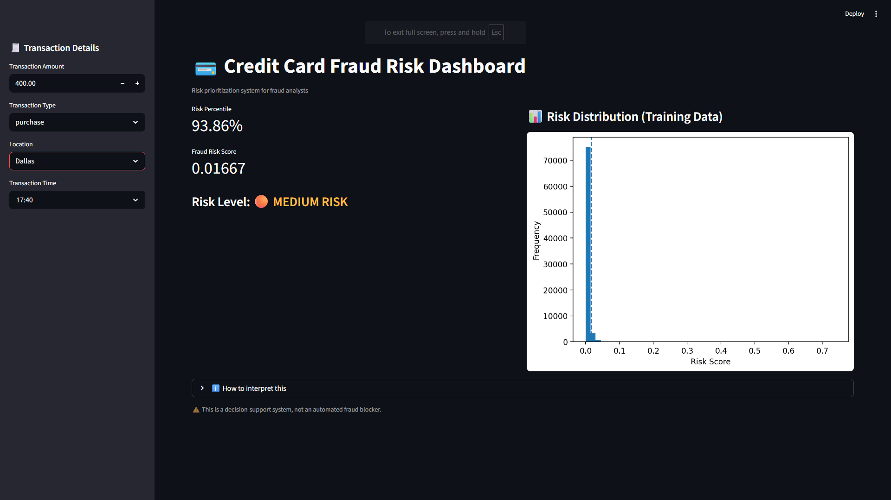
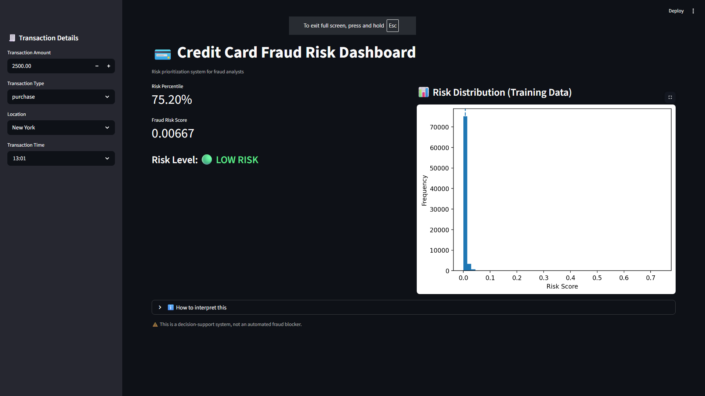

# 🟥 Credit Card Fraud Risk Prioritization System

A Machine Learning–based **fraud risk scoring and prioritization system** designed for financial institutions to identify and rank suspicious credit card transactions for manual review.
Instead of binary fraud prediction, the system focuses on **risk-based decision making**, which better reflects real-world banking operations.

---

## 🔥 Problem Statement

Credit card transaction data is **highly imbalanced**, with fraud cases typically below 1%.
In such scenarios:

* Accuracy becomes misleading
* Binary predictions fail to capture business risk
* Fraud teams need **prioritized alerts**, not yes/no decisions

This project addresses the problem by **ranking transactions based on fraud risk** so analysts can focus on the most suspicious cases first.

---

## 🎯 Project Objectives

* Build a fraud **risk scoring model** using Machine Learning
* Handle extreme class imbalance appropriately
* Avoid misleading accuracy-based evaluation
* Introduce **percentile-based risk prioritization**
* Provide an interactive **Streamlit dashboard** for fraud analysts
* Align model outputs with **real-world banking workflows**

---

## 🧠 Solution Approach

Instead of predicting *Fraud / Not Fraud* directly:

* The model outputs a **fraud probability score**
* Transactions are ranked by risk
* Risk is expressed as a **percentile**
* Analysts review the **top X% highest-risk transactions**

This mirrors **production-level fraud detection systems**.

---

## 🧰 Technologies Used

**Data & Analysis**: Pandas, NumPy, Matplotlib, Seaborn
**Machine Learning**: Random Forest (Primary), Logistic Regression (Baseline), Isolation Forest (Anomaly Detection)
**Preprocessing**: Feature engineering, One-Hot Encoding, StandardScaler, ColumnTransformer
**Evaluation Metrics**: ROC-AUC, PR-AUC, Fraud Capture @ K%, Percentile Thresholds
**Deployment**: Streamlit, Joblib (model persistence)

---

## 📊 Model Evaluation Strategy

Traditional metrics like accuracy were **intentionally avoided**.

| Metric                | Reason                            |
| --------------------- | --------------------------------- |
| ROC-AUC               | Measures ranking ability          |
| PR-AUC                | Focuses on minority (fraud) class |
| Fraud Capture @ K%    | Business-aligned metric           |
| Percentile Thresholds | Operational decision-making       |

---

## 🧮 Risk Prioritization Logic

* Model predicts **fraud probability**

* Probability is converted into a **risk percentile**

* Risk levels:

  * 🟢 Low Risk
  * 🟠 Medium Risk
  * 🔴 High Risk

* Analysts investigate **top-risk percentiles only**

---

## 🧠 Engineered Features

The model uses lightweight but business-relevant engineered features:

* Transaction Amount
* Hour of Transaction
* Day & Weekday
* Weekend Transaction Flag
* Night Transaction Flag
* High Amount Transaction Flag
* Transaction Type
* Transaction Location

---

## 🖥 Streamlit Dashboard Features

* Transaction input form
* Real-time fraud risk score
* Risk percentile calculation
* Visual risk indicator (Low / Medium / High)
* Business-friendly UI for fraud analysts

---

## 🖥 Streamlit Dashboard Preview

### Transaction Risk Evaluation Example

* **Input**: Transaction amount, location, transaction type, time
* **Output**:

  * Fraud Risk Score
  * Risk Percentile
  * Risk Level (Low / Medium / High)

📸 **Screenshots**:

### 🔴 High Risk Example



### 🟠 Medium Risk Example



### 🟢 Low Risk Example




> **Note:** Model artifact files (`.pkl`, `.npy`) are **not included in this repo** due to GitHub file size limits. You can generate them by running the notebook locally (`Credit_Card.ipynb`).

---

## 📁 Project Structure

```
CREDIT CARD FRAUD DETECTION/
├── src/                           # Modular source code
|   ├── api/                       # FastAPI backend
│   │   └── app.py
│   ├── components/
│   │   ├── data_ingestion.py      # Data loading and validation
│   │   ├── data_transformation.py # Data preprocessing and splitting
│   │   ├── feature_engineering.py # Feature extraction and preparation
│   │   ├── model_trainer.py       # Model training utilities
│   │   ├── model_evaluation.py    # Model evaluation and metrics
│   │   └── __init__.py
│   ├── pipeline/
│   │   ├── training_pipeline.py   # Complete training workflow
│   │   ├── prediction_pipeline.py # Real-time prediction engine
│   │   └── __init__.py
│   ├── exception.py               # Custom exceptions
│   ├── logger.py                  # Logging utilities
│   ├── utils.py                   # Constants and helper functions
│   └── __init__.py
├── app.py                         # Streamlit fraud risk dashboard
├── CREDIT_CARD.ipynb              # ML notebook (for training models)
├── credit_card_fraud_dataset.csv  # Input dataset
├── artifacts/                     # Generated locally (not in Git)
│   ├── fraud_rf_model.pkl
│   ├── preprocessor.pkl
│   ├── reference_scores.npy
│   └── feature_columns.pkl
├── requirements.txt
├── README.md
└── .gitignore
```

### 🏗️ Modular Architecture Breakdown

**`src/components/`** - Reusable ML components
- `data_ingestion.py`: Load & validate data
- `data_transformation.py`: Preprocessing, train-test split, feature scaling
- `feature_engineering.py`: Temporal features, one-hot encoding, user input prep
- `model_trainer.py`: Train Random Forest, Logistic Regression, Isolation Forest
- `model_evaluation.py`: Metrics (ROC-AUC, PR-AUC, fraud capture rate)

**`src/pipeline/`** - High-level workflows
- `training_pipeline.py`: Orchestrates complete model training (end-to-end)
- `prediction_pipeline.py`: Real-time fraud risk prediction for transactions

**`src/`** - Core utilities
- `exception.py`: Custom error handling
- `logger.py`: Logging for debugging & monitoring
- `utils.py`: Constants (thresholds, paths, locations)

---

## ▶ How to Run the Project

### 1️⃣ Install dependencies

```bash
pip install -r requirements.txt
```

### 2️⃣ Generate model artifacts (Train the model)

Run the Jupyter notebook to train the model:

```bash
jupyter notebook CREDIT_CARD.ipynb
```

Or open `CREDIT_CARD.ipynb` in VS Code and run all cells.

This generates:
- `artifacts/fraud_rf_model.pkl` - Trained Random Forest model
- `artifacts/preprocessor.pkl` - Data preprocessing pipeline
- `artifacts/feature_columns.pkl` - Feature column order
- `artifacts/reference_scores.npy` - Training data risk scores

### 3️⃣ Run Streamlit dashboard

```bash
streamlit run app.py
```

Dashboard will be available at: `http://localhost:8501`

### 4️⃣ Run the backend (FastAPI):

```bash
uvicorn app.main:app --reload
```

Backend default URL: 'http://127.0.0.1:8000'

---

## 💡 Using Components Directly

For advanced users, components can be imported and used independently:

```python
from src.components.data_ingestion import DataIngestion
from src.components.feature_engineering import FeatureEngineering
from src.components.model_trainer import ModelTrainer

# Load data
ingestion = DataIngestion()
df = ingestion.load_data("credit_card_fraud_dataset.csv")

# Engineer features
feature_eng = FeatureEngineering()
df_processed = feature_eng.prepare_features(df)

# Train models
trainer = ModelTrainer()
rf_model = trainer.train_random_forest(X_train, y_train)
```

---

## 🚀 Making Predictions

After training, use the Streamlit app OR predict programmatically:

```python
from src.pipeline.prediction_pipeline import PredictionPipeline

pipeline = PredictionPipeline()

# Single prediction
result = pipeline.predict_risk({
    "amount": 1500.0,
    "transaction_type": "purchase",
    "location": "New York",
    "transaction_time": "2024-01-15T14:30:00"
})

print(f"Risk Score: {result['risk_score']:.5f}")
print(f"Risk Percentile: {result['percentile']:.2f}%")
print(f"Risk Level: {result['risk_level']['label']}")
```

---

## 🧠 Business Interpretation

* **High Risk** → Immediate investigation
* **Medium Risk** → Monitor or review
* **Low Risk** → Auto-approve

> System **reduces false alarms** and improves fraud team efficiency.

---

## ⚠️ Key Learnings

* High accuracy ≠ good fraud model
* Imbalanced data requires ranking, not classification
* Percentile-based decisions reflect real banking systems
* ML success depends on **business alignment**

---

## 🚀 Future Improvements

* SHAP explainability dashboard
* Real-time transaction streaming
* Model monitoring & drift detection
* REST API deployment
* Cloud deployment (AWS/GCP)

---

## 👨‍💻 Author

**Sahil Dervankar**
B.Tech CSE (AI/ML)

Aspiring Machine Learning Engineer

---

